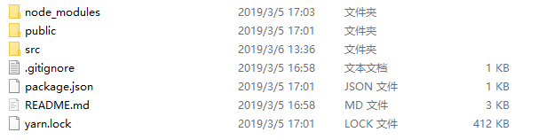

## 简介

ReactJs ReactNative ReactVR

Facebook 2013年 5月 推出 函数式编程风格

React16之后称为React Fiber

React和vue:

React灵活度比较高
vue提供的api比较丰富

## 开发环境

使用方式：
1.通过引入.js文件来使用React
2.通过脚手架工具来编码

脚手架工具：grunt webpack gulp
推荐：官方的create-react-app

node下载 LTS版本

项目创建方式
``` 
npx create-react-app my-app
cd my-app
npm start
```

## 目录结构



- yarn.lock

项目依赖的安装包信息，一般不需要动

- README.md

项目的说明文件 

- package.json

node包文件

- node_modules

项目依赖的第三方包文件，不需要动

- public和src

项目源代码

- public/manifest.json

桌面快捷方式

- public/index.html

项目启动首页

